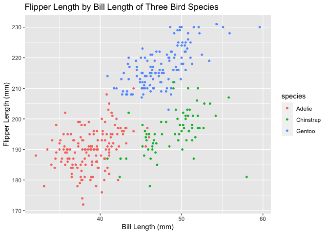

p8105\_HW1\_jgc2157
================
Gunnar
9/23/2021

loading tidyverse

``` r
library(tidyverse)
```

    ## ── Attaching packages ─────────────────────────────────────── tidyverse 1.3.1 ──

    ## ✓ ggplot2 3.3.5     ✓ purrr   0.3.4
    ## ✓ tibble  3.1.4     ✓ dplyr   1.0.7
    ## ✓ tidyr   1.1.3     ✓ stringr 1.4.0
    ## ✓ readr   2.0.1     ✓ forcats 0.5.1

    ## ── Conflicts ────────────────────────────────────────── tidyverse_conflicts() ──
    ## x dplyr::filter() masks stats::filter()
    ## x dplyr::lag()    masks stats::lag()

# *Problem 1*

Creating a data frame with: a random sample of size 10 from a standard
Normal distribution a logical vector indicating whether elements of the
sample are greater than 0 a character vector of 10 letters a factor
vector of length 10, with 3 different factor levels - dog, cat, mouse

``` r
problem1_df <- tibble(rsample = rnorm(10),
                      greater_than_zero = rsample > 0,
                      letters_list = letters[1:10],
                      animals = rep(as_factor(c("dog", "cat", "mouse")), length.out = 10))
problem1_df
```

    ## # A tibble: 10 × 4
    ##    rsample greater_than_zero letters_list animals
    ##      <dbl> <lgl>             <chr>        <fct>  
    ##  1   0.538 TRUE              a            dog    
    ##  2  -1.03  FALSE             b            cat    
    ##  3  -1.11  FALSE             c            mouse  
    ##  4  -1.69  FALSE             d            dog    
    ##  5  -1.68  FALSE             e            cat    
    ##  6   1.54  TRUE              f            mouse  
    ##  7  -0.806 FALSE             g            dog    
    ##  8  -1.23  FALSE             h            cat    
    ##  9   0.362 TRUE              i            mouse  
    ## 10   0.655 TRUE              j            dog

Attempting to pull the means of each variable from problem1\_df

``` r
problem1_df %>%
  pull(rsample) %>%
  mean()
```

    ## [1] -0.4452727

``` r
problem1_df %>%
  pull(greater_than_zero) %>%
  mean()
```

    ## [1] 0.4

``` r
problem1_df %>%
  pull(letters_list) %>%
  mean()
```

    ## Warning in mean.default(.): argument is not numeric or logical: returning NA

    ## [1] NA

``` r
problem1_df %>%
  pull(animals) %>%
  mean()
```

    ## Warning in mean.default(.): argument is not numeric or logical: returning NA

    ## [1] NA

Applying as.numeric to the logical, character, and factor variables in
problem1\_df

``` r
problem1_df %>%
  pull(greater_than_zero) %>%
  as.numeric()

problem1_df %>%
  pull(letters_list) %>%
  as.numeric()
```

    ## Warning in problem1_df %>% pull(letters_list) %>% as.numeric(): NAs introduced
    ## by coercion

``` r
problem1_df %>%
  pull(animals) %>%
  as.numeric()
```

The logical variable when converted into a numeric variable becomes a
binary variable of 0 and 1 because 1 represents TRUE and 0 represents
FALSE. This is why a mean can be found for a logical vector.

The character vector when converted into a numeric variable returns a
vector of missing values as characters do not correspond to a numeric
value. A mean cannot be found for a character vector because of this.

The factor vector when converted into a numeric variable returns a
numeric vector reflecting the levels of the factor which are character
values. As factor levels are not numeric values, a mean cannot be found
for them.

# *Problem 2*

Loading penguin data set

``` r
data("penguins", package = "palmerpenguins")
```

Summary of penguin data set

``` r
summary(penguins)
```

    ##       species          island    bill_length_mm  bill_depth_mm  
    ##  Adelie   :152   Biscoe   :168   Min.   :32.10   Min.   :13.10  
    ##  Chinstrap: 68   Dream    :124   1st Qu.:39.23   1st Qu.:15.60  
    ##  Gentoo   :124   Torgersen: 52   Median :44.45   Median :17.30  
    ##                                  Mean   :43.92   Mean   :17.15  
    ##                                  3rd Qu.:48.50   3rd Qu.:18.70  
    ##                                  Max.   :59.60   Max.   :21.50  
    ##                                  NA's   :2       NA's   :2      
    ##  flipper_length_mm  body_mass_g       sex           year     
    ##  Min.   :172.0     Min.   :2700   female:165   Min.   :2007  
    ##  1st Qu.:190.0     1st Qu.:3550   male  :168   1st Qu.:2007  
    ##  Median :197.0     Median :4050   NA's  : 11   Median :2008  
    ##  Mean   :200.9     Mean   :4202                Mean   :2008  
    ##  3rd Qu.:213.0     3rd Qu.:4750                3rd Qu.:2009  
    ##  Max.   :231.0     Max.   :6300                Max.   :2009  
    ##  NA's   :2         NA's   :2

``` r
nrow(penguins)
```

    ## [1] 344

``` r
ncol(penguins)
```

    ## [1] 8

*Description of the penguins data set.* The penguins data set has 8
variables: species, island, bill\_length\_mm, bill\_depth\_mm,
flipper\_length\_mm, body\_mass)g, sex, and year. The data set also has
344 rows. The data set contains information on three bird species
(Adelie, Chinstrap, and Gentoo) from three islands (Biscoe, Dream, and
Torgersen). The mean flipper length for all birds is 200.9 mm.

*Scatter plot of flipper length by bill length with color indicating
species.*

``` r
ggplot(penguins, aes(x = bill_length_mm, y = flipper_length_mm, color = species)) +
  geom_point(size = 1) +
  ggtitle("Flipper Length by Bill Length of Three Bird Species") +
  xlab("Bill Length (mm)") +
  ylab("Flipper Length (mm)")
```

    ## Warning: Removed 2 rows containing missing values (geom_point).

<!-- -->

``` r
ggsave("birds_figure1.png", width = 30, height = 30)
```

    ## Warning: Removed 2 rows containing missing values (geom_point).
